# Stage 1 Implementation Plan
## Student Expense Tracker — CLI Core

> Stage 1 delivers a complete, fully-usable CLI tool. Every decision made here must survive untouched through Stages 2–7.
> No reminders, no summaries, no web UI, no insights. Just the data model, the calculations, and the commands.

### Current checkpoint (2026-04-15)
- Phase A and Phase B are complete.
- Phase C is in progress: `IncomeService.add_income`, `ChargeService.add_charge`, `ChargeService.add_recurring_charge`, and recurring `ChargeService.mark_paid` behavior are implemented with unit tests.
- Full `tests/unit` status at this checkpoint: `101 passed`.
- Live implementation tracking is maintained in `Docs/stage1_implementation_status.md`.

---

## What Stage 1 Delivers

A command-line tool that:
- Creates a session with an opening balance
- Logs income from multiple sources
- Logs committed charges (one-off, recurring, and fuzzy)
- Logs daily spending
- Calculates and displays free money and monthly on-track state

**Definition of done:** A student can run `session init`, log their rent and scholarship, log a coffee, and see an honest number telling them whether they are on track this month.

---

## Scope Boundaries

### In scope
- `AppSession` — continuous session model, no forced reset
- `IncomeEntry` — income with source tags
- `CommittedCharge` — one-off future payments
- `RecurringRule` — recurring charge definition and next-occurrence generation
- `FuzzyCharge` — date-known, amount-unknown charges
- `Transaction` — actual spend events with optional category
- `BalanceEngine` — free money, monthly budget/spent/left, on-track state, balance state

### Stage boundary — what is not built here

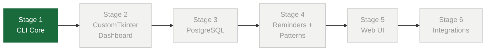

---

## Architecture

Four strict layers. No layer may depend on a layer above it.

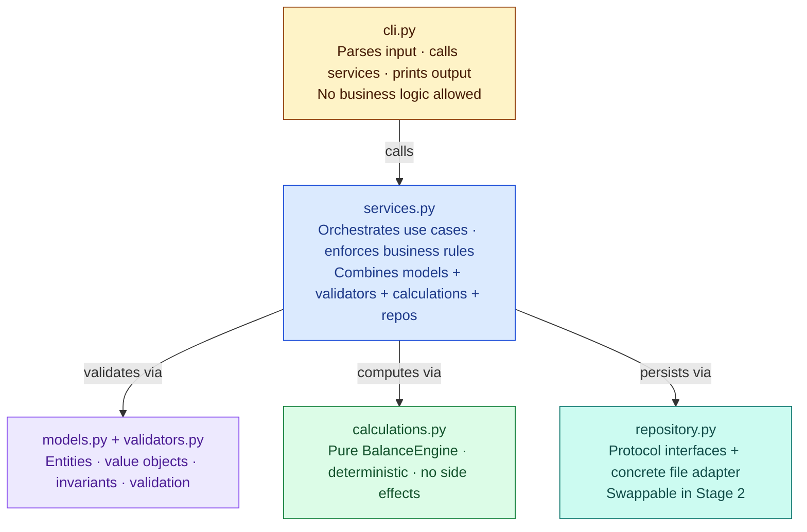

### Module dependency graph

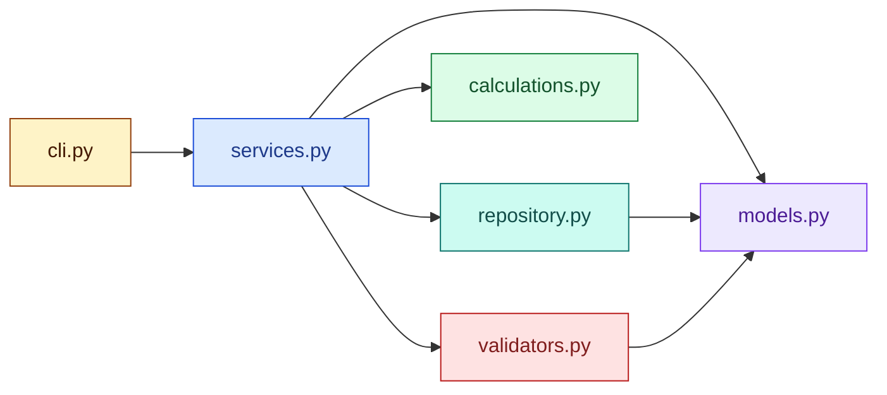

### Module responsibilities

| File | Responsibility |
|---|---|
| `main.py` | Entrypoint — boots app, delegates to CLI routing |
| `cli.py` | Parses commands, calls services, prints output. No business logic. |
| `services.py` | Orchestrates use cases. Combines models, validators, calculations, repositories. |
| `models.py` | Domain entities and value objects |
| `validators.py` | Input validation and domain constraint enforcement |
| `calculations.py` | Pure `BalanceEngine` logic — deterministic, no side effects |
| `repository.py` | Repository protocols (interfaces) + concrete file-based adapter |

### Key design rules
- **Money:** `Decimal` only — no `float` anywhere in the codebase
- **Dates:** single centralised date utility — no raw `datetime` scattered across modules
- **Interfaces:** `typing.Protocol` for all repository contracts — implementations are swappable
- **CLI is thin:** CLI never mutates domain state directly. All writes go through service methods.
- **Services are pure orchestrators:** no storage details, no formatting, no print statements
- **Calculations are pure functions:** `BalanceEngine` takes inputs, returns outputs, touches no state

---

## Data Model

### Entity relationships

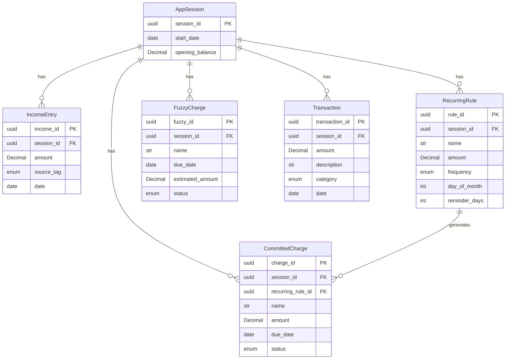

### Field reference

**AppSession**
```
session_id       uuid
start_date       date
opening_balance  Decimal
```

**IncomeEntry**
```
income_id        uuid
session_id       uuid
amount           Decimal
source_tag       enum(scholarship, family, work, other)
date             date
```

**CommittedCharge**
```
charge_id          uuid
session_id         uuid
name               str
amount             Decimal
due_date           date
status             enum(upcoming, paid)
recurring_rule_id  uuid | None
```

**RecurringRule**
```
rule_id          uuid
session_id       uuid
name             str
amount           Decimal
frequency        enum(monthly)  # Stage 1: monthly only
                               # weekly and custom deferred to Stage 2 —
                               # they require different anchor fields not modelled here
day_of_month     int            # required, range 1–31
reminder_days    int            # default 3, overridable per charge
```

> **Stage 1 constraint — monthly only:** `weekly` and `custom` frequencies need anchor fields
> that don't exist in this model (day-of-week, interval in days, explicit date list). Rather than
> ship undefined behaviour, Stage 1 locks `frequency` to `monthly` only. `day_of_month` is
> required — omitting it when using `--recurring` is a validation error. Valid range is 1–31.
> Weekly and custom are designed properly in Stage 2.

**FuzzyCharge**
```
fuzzy_id          uuid
session_id        uuid
name              str
due_date          date
estimated_amount  Decimal | None  # reference only — never used in calculations
status            enum(pending, overdue, resolved, discarded)
```

**Transaction**
```
transaction_id   uuid
session_id       uuid
amount           Decimal
description      str
category         enum(food, transport, education, entertainment, other) | None
date             date
```

---

## BalanceEngine — Calculation Contracts

All outputs are deterministic. Given the same inputs, always produces the same outputs.

### Input → output flow

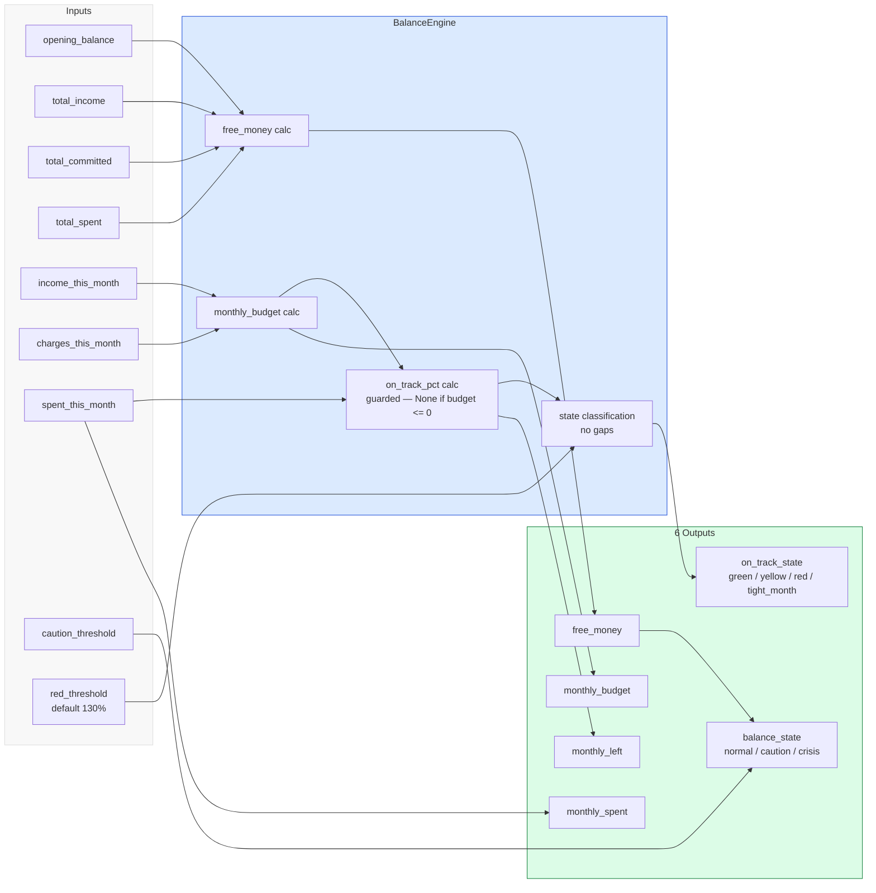

### Formulas

```python
# Free money — the core number (full session scope)
free_money = opening_balance + total_income - total_committed - total_spent

# Monthly budget — for the current calendar month
income_this_month  = sum(income entries dated this calendar month)
charges_this_month = sum(committed charges due this calendar month)
monthly_budget     = income_this_month - charges_this_month
monthly_spent      = sum(transactions dated this calendar month)
monthly_left       = monthly_budget - monthly_spent

# On-track percentage — guarded against zero/negative monthly_budget
if monthly_budget > 0:
    on_track_pct   = monthly_spent / monthly_budget * 100
else:
    on_track_pct   = None          # tight_month — no division performed

# On-track state — no gaps, no unclassified ranges
# yellow covers the full 100%–129% band (no gap between yellow and red)
# red_threshold default is 130%; yellow_threshold parameter is removed
if on_track_pct is None:
    on_track_state = tight_month   # monthly_budget <= 0; shown as a distinct state
elif on_track_pct < 100:
    on_track_state = green         # under budget
elif on_track_pct < red_threshold: # 100% up to (not including) 130% → yellow
    on_track_state = yellow
else:
    on_track_state = red           # 130% and above

# Balance state (full session scope — independent of monthly view)
balance_state  = normal   if free_money > caution_threshold
               | caution  if 0 < free_money <= caution_threshold
               | crisis   if free_money <= 0
```

> **Fix — yellow_threshold removed:** The original design had a `yellow_threshold` (110%) that
> left 110%–129% unclassified. That parameter is removed. Yellow now covers the entire range from
> 100% up to (but not including) `red_threshold` (default 130%). No gap exists.
>
> **Fix — monthly_budget ≤ 0 handled:** When `monthly_budget == 0` (charges equal income this
> month) or `monthly_budget < 0` (charges exceed income this month), `on_track_pct` is set to
> `None` and `on_track_state` becomes `tight_month`. This is a distinct state from `red` — it
> means the month's structure has no spendable budget, not that the student overspent. The
> dashboard surfaces it as: *"No spendable budget this month — charges equal or exceed expected
> income."* Overall `free_money` (full session scope) may still be positive.

### State decision tree

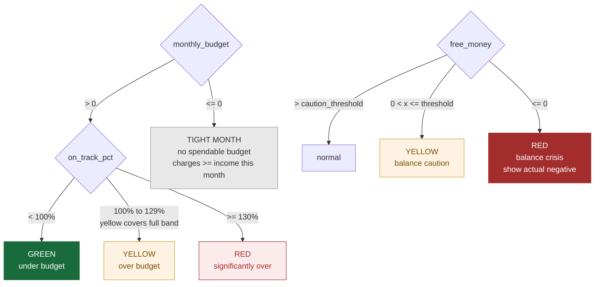

---

## Charge Lifecycles

### Committed charge — one-off

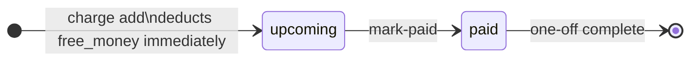

### Committed charge — recurring

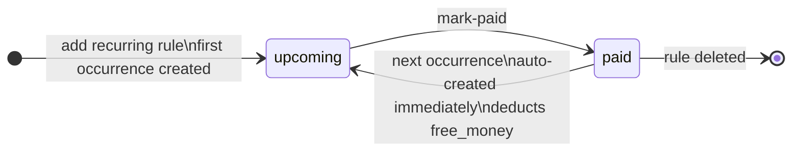

### Fuzzy charge — full lifecycle

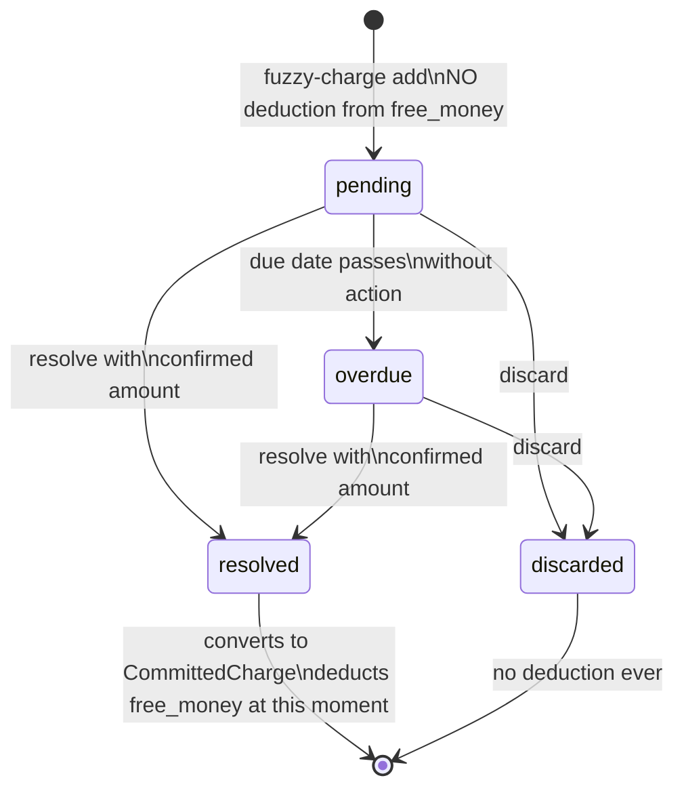

> **Invariant:** A `FuzzyCharge` in any state never affects `free_money`. Only a resolved FuzzyCharge
> that converts to a `CommittedCharge` affects the balance — and only at the moment of conversion.

---

## CLI Commands

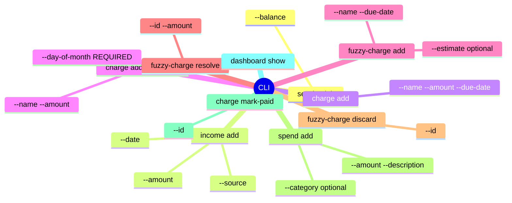

| Command | Arguments | What it does |
|---|---|---|
| `session init` | `--balance` | Creates AppSession with opening balance |
| `income add` | `--amount --source --date` | Logs an IncomeEntry |
| `charge add` | `--name --amount --due-date` | Logs a one-off CommittedCharge |
| `charge add --recurring` | `--name --amount --day-of-month` | Logs a RecurringRule (monthly only). `--day-of-month` is **required** — omitting it is a validation error. Creates first occurrence immediately. |
| `fuzzy-charge add` | `--name --due-date [--estimate]` | Logs a FuzzyCharge |
| `fuzzy-charge resolve` | `--id --amount` | Resolves fuzzy charge, converts to committed |
| `fuzzy-charge discard` | `--id` | Discards fuzzy charge |
| `spend add` | `--amount --description [--category] [--date]` | Logs a Transaction |
| `charge mark-paid` | `--id` | Marks charge paid, auto-generates next occurrence if recurring |
| `dashboard show` | — | Prints free money, monthly state, on-track signal |

---

## Repository Interfaces

Defined as `typing.Protocol`. The Stage 1 adapter writes to local JSON files. Stage 3 replaces the adapter with PostgreSQL — **service code does not change**.

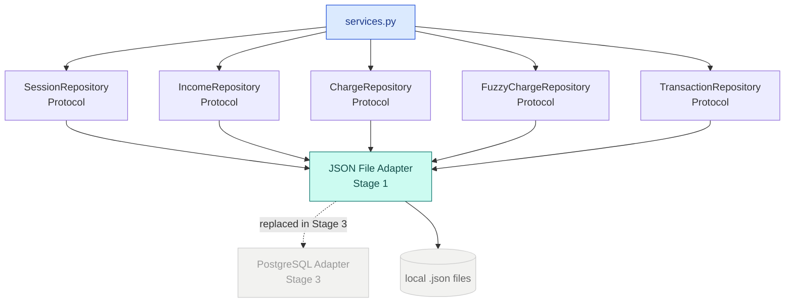

```python
class SessionRepository(Protocol):
    def create(self, session: AppSession) -> None: ...
    def get_active(self) -> AppSession | None: ...

class IncomeRepository(Protocol):
    def add(self, entry: IncomeEntry) -> None: ...
    def list_for_session(self, session_id: UUID) -> list[IncomeEntry]: ...
    def list_for_month(self, session_id: UUID, year: int, month: int) -> list[IncomeEntry]: ...

class ChargeRepository(Protocol):
    def add(self, charge: CommittedCharge) -> None: ...
    def list_upcoming(self, session_id: UUID) -> list[CommittedCharge]: ...
    def list_for_month(self, session_id: UUID, year: int, month: int) -> list[CommittedCharge]: ...
    def mark_paid(self, charge_id: UUID) -> None: ...

class FuzzyChargeRepository(Protocol):
    def add(self, charge: FuzzyCharge) -> None: ...
    def list_pending(self, session_id: UUID) -> list[FuzzyCharge]: ...
    def update_status(self, fuzzy_id: UUID, status: FuzzyStatus) -> None: ...

class TransactionRepository(Protocol):
    def add(self, transaction: Transaction) -> None: ...
    def list_for_month(self, session_id: UUID, year: int, month: int) -> list[Transaction]: ...
```

---

## Testing Strategy

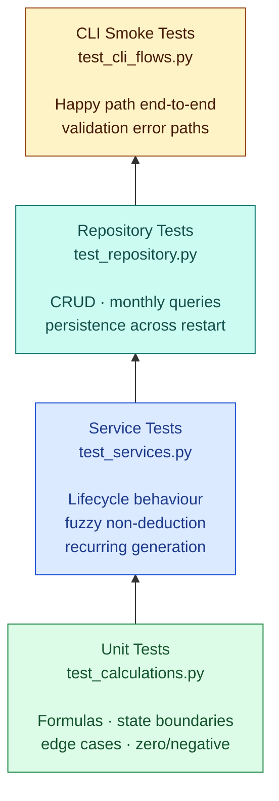

### Unit — `tests/test_calculations.py`
- Free money formula with known inputs
- Monthly budget calculation (income this month minus charges this month)
- On-track percentage and state boundaries (exactly at 100%, 110%, 130%)
- Balance state boundaries (positive, zero, negative free money)
- Edge cases: no income logged yet, no charges logged yet, empty month

### Service — `tests/test_services.py`
- Recurring charge: mark-paid creates next occurrence with correct due date
- Recurring charge: next occurrence deducts from free money immediately
- Fuzzy charge: adding does not affect free money
- Fuzzy charge: resolving converts to committed charge and deducts at that moment
- Fuzzy charge: discarding does not affect free money
- FuzzyCharge and CommittedCharge remain in separate stores at all times

### Repository — `tests/test_repository.py`
- CRUD operations for all five entities
- `list_for_month` returns only entries in the correct calendar month
- Data persists correctly across a simulated restart

### CLI smoke tests — `tests/test_cli_flows.py`
- Happy path: `session init` → `income add` → `charge add` → `spend add` → `dashboard show`
- Validation error path: missing required arguments surface a clear error message
- Unknown command: surfaces a helpful usage hint

---

## Build Sequence

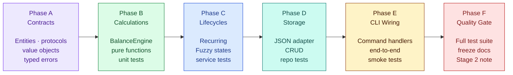

**Phase A — Contracts**
Define entity data classes, value objects, repository protocols, and typed error classes. No implementation yet — just the shapes everything else depends on.

**Phase B — Calculations**
Implement `BalanceEngine` as pure functions. Write unit tests. Done when every formula is verified with known inputs.

**Phase C — Charge lifecycles**
Implement fuzzy charge state transitions and spend transactions in `services.py`. Base income, committed-charge creation, recurring-rule creation, and recurring next-occurrence generation are already in place; this phase completes the remaining lifecycle behavior and adds service coverage for those paths.

**Phase D — Storage**
Implement the local JSON file adapter for each repository protocol. Write repository tests. Done when data survives a simulated restart.

**Phase E — CLI wiring**
Wire all CLI commands to their service methods. Write CLI smoke tests. Done when the full happy-path flow works end-to-end from the terminal.

**Phase F — Quality gate**
Run the full test suite. Fix any failures. Freeze Stage 1 behaviour in docs. Write Stage 2 handoff note.

---

## Risks and Mitigations

| Risk | Mitigation |
|---|---|
| Money precision bugs | `Decimal` enforced everywhere. `float` forbidden. Linting rule if possible. |
| Date edge-case bugs | Single `date_utils.py` module. No raw `datetime` outside it. Boundary tests at month transitions. |
| FuzzyCharge contaminating BalanceEngine | Separate repository protocol enforced architecturally. Service tests verify non-deduction. |
| Scope creep into Stage 2+ features | Explicit out-of-scope list in this document. Any addition requires updating this plan first. |
| Business logic leaking into CLI | Rule: `cli.py` contains no arithmetic, no domain decisions, no direct model mutation. |
| Division by zero in on_track_pct | `monthly_budget <= 0` check is the first operation in the on-track calculation. Returns `tight_month` state before any division is attempted. Unit test required. |
| `day_of_month` out of range | `day_of_month` validated to range 1–31. Values outside this range are rejected with a clear error at `charge add --recurring` time, not at occurrence-generation time. |

---

## Stage 2 Handoff Note

Stage 2 replaces `app/cli.py` with a CustomTkinter desktop GUI. To prepare for a clean handoff:
- All service calls must go through the existing service interfaces — the GUI calls services, never repositories directly
- All business logic stays in the service layer — no calculation or validation logic may move into the GUI layer
- The JSON storage layer remains unchanged in Stage 2 — persistence migration happens in Stage 3 (PostgreSQL)
- No Stage 3+ logic (pattern detection, reminders, history queries) may be added to Stage 1 modules, even as stubs

---

*Stage 1 — locked scope. April 2026.*
