# Stage 1 — Implementation Status
**Student Expense Tracker — CLI Core**
*Audited: 2026-04-22*

> This document is a point-in-time snapshot of what has been built, what is working,
> and what remains before Stage 1 is complete. It maps directly against the Stage 1 Implementation Plan.

---

## Overall Position

**Current phase:** Phase E — CLI wiring in progress (Phase D storage complete).
**Test suite:** 196 / 196 passing (unit suite).

## Financial Conventions

- Monetary values are stored as positive `Decimal` amounts (`> 0`) in domain entities.
- Inflow/outflow is determined by entity semantics (`IncomeEntry` inflow, charge/transaction outflow), not numeric sign.
- `FuzzyCharge` supports uncertain expense or income via `direction`.
- `FuzzyCharge.estimated_amount` is optional and must be positive when provided.
- `resolve(...)` always requires positive `resolved_amount` and it may differ from `estimated_amount`.

```mermaid
gantt
    title Stage 1 Build Sequence — Progress
    dateFormat X
    axisFormat %s

    section Phase A — Contracts
    Entities · Protocols · Errors   :done, a1, 0, 1

    section Phase B — Calculations
    BalanceEngine · Unit Tests      :done, b1, 1, 2

    section Phase C — Lifecycles
    Services · Validators · Service Tests :done, c1, 2, 3

    section Phase D — Storage
    JSON Adapters · Repo Tests      :done, d1, 3, 4

    section Phase E — CLI Wiring
    Command Handlers · Smoke Tests  :active, e1, 4, 5

    section Phase F — Quality Gate
    Full Suite · Freeze Docs        :c1, 5, 6
```

---

## Phase Progress — At a Glance

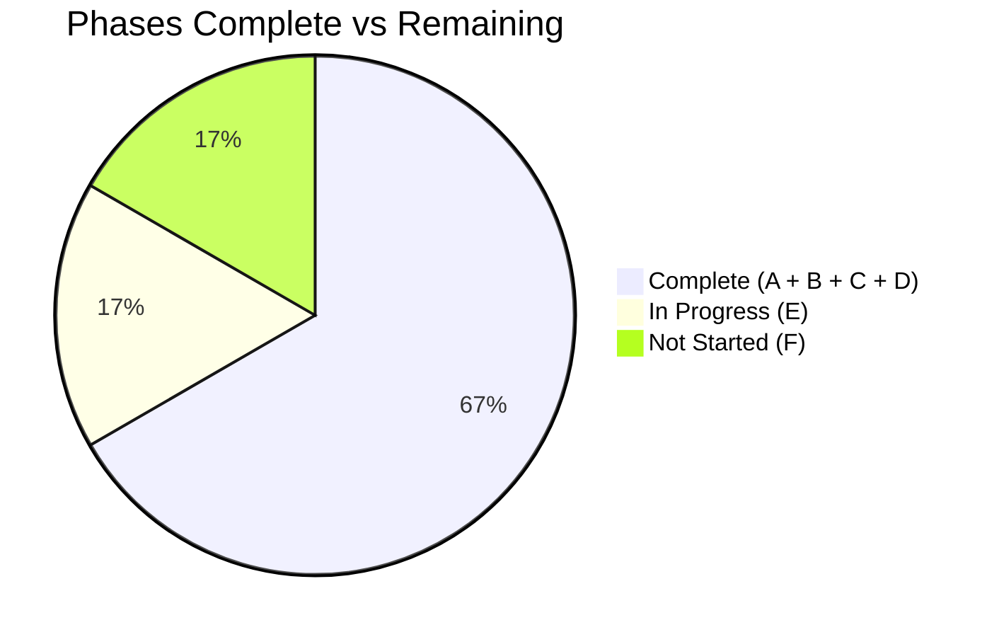

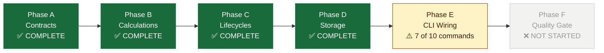

---

## Phase A — Contracts `COMPLETE`

All domain entities, value objects, repository protocols, and typed errors are in place.

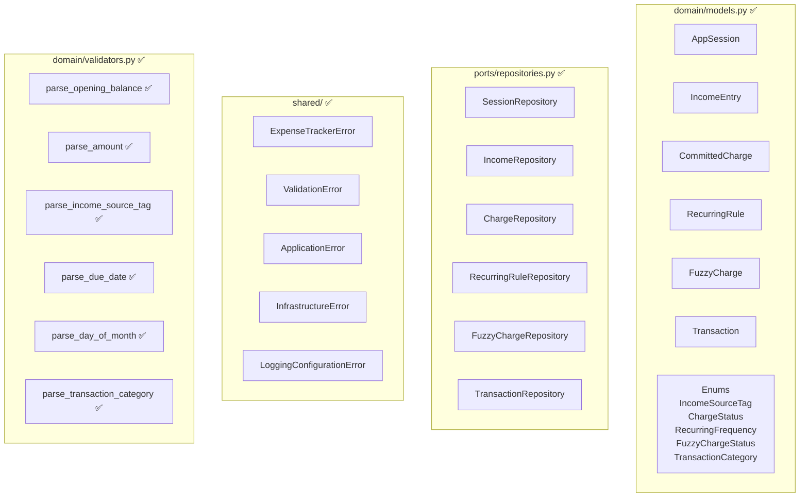

| Artifact | File | Status |
|---|---|---|
| `AppSession` | `domain/models.py` | ✅ |
| `IncomeEntry` | `domain/models.py` | ✅ |
| `CommittedCharge` | `domain/models.py` | ✅ |
| `RecurringRule` | `domain/models.py` | ✅ |
| `FuzzyCharge` | `domain/models.py` | ✅ |
| `Transaction` | `domain/models.py` | ✅ |
| All enums | `domain/models.py` | ✅ |
| `parse_opening_balance` | `domain/validators.py` | ✅ |
| `parse_amount` | `domain/validators.py` | ✅ |
| `parse_income_source_tag` | `domain/validators.py` | ✅ |
| `parse_due_date` | `domain/validators.py` | ✅ |
| `parse_day_of_month` | `domain/validators.py` | ✅ |
| `parse_transaction_category` | `domain/validators.py` | ✅ |
| `SessionRepository` | `ports/repositories.py` | ✅ |
| `IncomeRepository` | `ports/repositories.py` | ✅ |
| `ChargeRepository` | `ports/repositories.py` | ✅ |
| `RecurringRuleRepository` | `ports/repositories.py` | ✅ |
| `FuzzyChargeRepository` | `ports/repositories.py` | ✅ |
| `TransactionRepository` | `ports/repositories.py` | ✅ |
| Exception hierarchy | `shared/exceptions.py` | ✅ |
| `LoggerFactory` | `infrastructure/logging_config.py` | ✅ |

> **Note on validators:** all Stage 1 validator functions are now implemented and covered by
> `tests/unit/test_validators.py`.

---

## Phase B — Calculations `COMPLETE`

`BalanceEngine` is pure, deterministic, and fully tested at all spec boundaries.

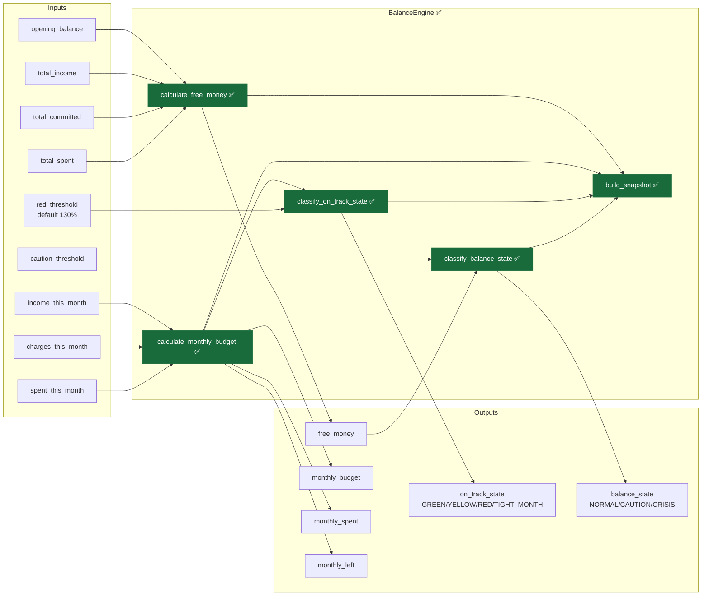

| Artifact | File | Status |
|---|---|---|
| `BalanceEngine.calculate_free_money` | `application/calculations.py` | ✅ |
| `BalanceEngine.calculate_monthly_budget` | `application/calculations.py` | ✅ |
| `BalanceEngine.classify_on_track_state` | `application/calculations.py` | ✅ |
| `BalanceEngine.classify_balance_state` | `application/calculations.py` | ✅ |
| `BalanceEngine.build_snapshot` | `application/calculations.py` | ✅ |
| `MonthlyBudgetView` output type | `application/calculations.py` | ✅ |
| `BalanceSnapshot` output type | `application/calculations.py` | ✅ |
| Unit tests — free money (4 cases) | `tests/unit/test_calculations.py` | ✅ |
| Unit tests — balance state (5 boundary cases) | `tests/unit/test_calculations.py` | ✅ |
| Unit tests — on-track state (7 boundary cases) | `tests/unit/test_calculations.py` | ✅ |
| Unit tests — monthly budget (4 cases) | `tests/unit/test_calculations.py` | ✅ |
| Unit tests — snapshot composition (2 cases) | `tests/unit/test_calculations.py` | ✅ |
| Cross-cutting tests — exceptions + logging | `tests/unit/test_shared_cross_cutting.py` | ✅ |

**Total: calculations remain fully green; full unit suite now passes 196 / 196.**

---

## Phase C — Charge Lifecycles `COMPLETE`

All service lifecycles are implemented and covered by unit tests.

### Services needed

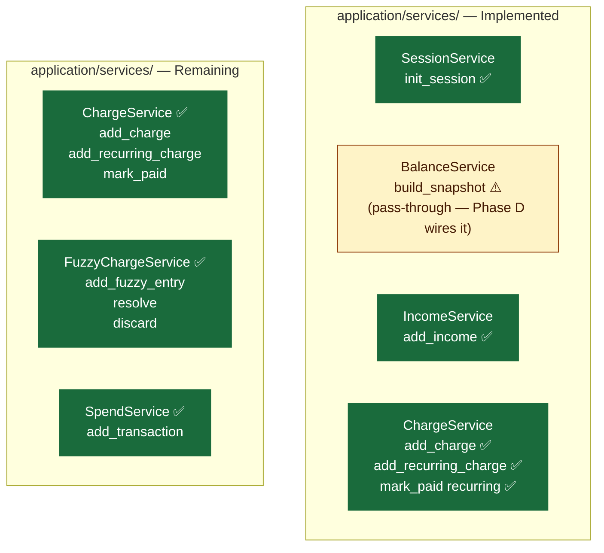

| Service | Method | Behaviour |
|---|---|---|
| `IncomeService` | `add_income(amount, source_tag, entry_date)` | ✅ Implemented — validates input, creates `IncomeEntry`, persists for active session |
| `ChargeService` | `add_charge(name, amount, due_date)` | ✅ Implemented — creates `CommittedCharge` with `status=UPCOMING` for active session |
| `ChargeService` | `add_recurring_charge(name, amount, day_of_month)` | ✅ Implemented — creates `RecurringRule` and first `CommittedCharge` occurrence |
| `ChargeService` | `mark_paid(charge_id)` | ✅ Implemented — marks paid and creates the next recurring occurrence when linked to a rule |
| `FuzzyChargeService` | `add_fuzzy_entry(name, direction, expected_date, estimated_amount)` | ✅ Implemented — creates pending uncertain entry for **expense or income** with optional date/estimate |
| `FuzzyChargeService` | `resolve(fuzzy_id, resolved_amount, resolved_date, income_source_tag)` | ✅ Implemented — sets `status=RESOLVED`, amount may differ from estimate, creates committed charge (expense) or income entry (income) |
| `FuzzyChargeService` | `discard(fuzzy_id)` | ✅ Implemented — sets `status=DISCARDED` without creating concrete records |
| `SpendService` | `add_transaction(amount, description, category, spent_on)` | ✅ Implemented — validates spend input, creates `Transaction`, persists for active session |

### Charge lifecycles remaining

```mermaid
stateDiagram-v2
    direction LR
    note right of upcoming : One-off lifecycle
    [*] --> upcoming : add_charge\ndeducts free_money immediately
    upcoming --> paid : mark_paid
    paid --> [*]
```

```mermaid
stateDiagram-v2
    direction LR
    note right of upcoming : Recurring lifecycle
    [*] --> upcoming : add_recurring_charge\nfirst occurrence created
    upcoming --> paid : mark_paid
    paid --> upcoming : next occurrence\nauto-created immediately
    paid --> [*] : rule deleted
```

```mermaid
stateDiagram-v2
    note right of pending : Fuzzy lifecycle — never touches free_money directly
    [*] --> pending : add_fuzzy_charge\nNO deduction
    pending --> overdue : due date passes
    pending --> resolved : resolve with confirmed amount
    pending --> discarded : discard
    overdue --> resolved : resolve with confirmed amount
    overdue --> discarded : discard
    resolved --> [*] : converts to CommittedCharge\ndeducts free_money HERE
    discarded --> [*] : no deduction ever
```

### Service tests status

Implemented files:
- `tests/unit/test_income_service.py`
- `tests/unit/test_charge_service.py`
- `tests/unit/test_fuzzy_charge_service.py`
- `tests/unit/test_spend_service.py`

Still needed before closing Phase C:

| Test | What it verifies |
|---|---|
| Charge mark-paid + recurring occurrence remains stable under calendar edge cases | Prevent month-end regressions in production adapters |
| Fuzzy overdue automation policy is explicitly decided (service or scheduler) | Avoid hidden behavior drift in Phase D/E |

---

## Phase D — Storage `COMPLETE`

All JSON repository adapters are implemented and covered by repository tests.

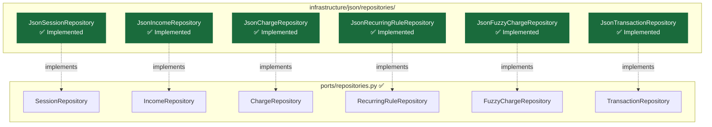

| Adapter | Status | Notes |
|---|---|---|
| `JsonSessionRepository` | ✅ Complete | `create`, `get_active` implemented |
| `JsonIncomeRepository` | ✅ Complete | `add`, `list_for_session`, `list_for_month` implemented |
| `JsonChargeRepository` | ✅ Complete | `add`, `list_upcoming`, `list_for_month`, `mark_paid`, `get_by_id` implemented |
| `JsonRecurringRuleRepository` | ✅ Complete | `add`, `get_by_id`, `list_for_session` implemented |
| `JsonFuzzyChargeRepository` | ✅ Complete | `add`, `get_by_id`, `list_pending`, `update_status`, `update` implemented |
| `JsonTransactionRepository` | ✅ Complete | `add`, `list_for_month` implemented |
| Repository tests | ✅ Complete | `tests/unit/test_repositories.py` (34 tests passing) |

**Serialisation rules implemented:**
- `Decimal` persisted as `str`
- `date` persisted as ISO 8601 (`YYYY-MM-DD`)
- `UUID` persisted as `str`
- `Enum` persisted as `.value`

---

## Phase E — CLI Wiring `7 of 10 commands`

```mermaid
graph TD
    CLI[CliApplication]

    CLI --> SI["session init\n✅ WIRED"]
    CLI --> IA["income add\n✅ WIRED"]
    CLI --> CA["charge add\n✅ WIRED"]
    CLI --> CAR["charge add --recurring\n✅ WIRED"]
    CLI --> FCA["fuzzy-charge add\n✅ WIRED"]
    CLI --> FCR["fuzzy-charge resolve\n✅ WIRED"]
    CLI --> FCD["fuzzy-charge discard\n✅ WIRED"]
    CLI --> SA["spend add\n❌ Missing"]
    CLI --> CMP["charge mark-paid\n❌ Missing"]
    CLI --> DS["dashboard show\n⚠️ Scaffold only\nPhase D dependency"]

    style SI fill:#1a6b3c,color:#fff,stroke:#1a6b3c
    style DS fill:#fef3c7,stroke:#92400e,color:#451a03
    style IA fill:#1a6b3c,color:#fff,stroke:#1a6b3c
    style CA fill:#1a6b3c,color:#fff,stroke:#1a6b3c
    style CAR fill:#1a6b3c,color:#fff,stroke:#1a6b3c
    style FCA fill:#1a6b3c,color:#fff,stroke:#1a6b3c
    style FCR fill:#1a6b3c,color:#fff,stroke:#1a6b3c
    style FCD fill:#1a6b3c,color:#fff,stroke:#1a6b3c
    style SA fill:#f2f2f0,stroke:#ccc,color:#999
    style CMP fill:#f2f2f0,stroke:#ccc,color:#999
```

| Command | Arguments | Handler | Status |
|---|---|---|---|
| `session init` | `--balance` | `handle_session_init` | ✅ |
| `income add` | `--amount --source --date` | `handle_income_add` | ✅ |
| `charge add` | `--name --amount --due-date` | `handle_charge_add` | ✅ |
| `charge add --recurring` | `--name --amount --day-of-month` | `handle_charge_add` | ✅ |
| `fuzzy-charge add` | `--name --due-date [--estimate]` | `handle_fuzzy_charge_add` | ✅ |
| `fuzzy-charge resolve` | `--id --amount` | `handle_fuzzy_charge_resolve` | ✅ |
| `fuzzy-charge discard` | `--id` | `handle_fuzzy_charge_discard` | ✅ |
| `spend add` | `--amount --description [--category] [--date]` | — | ❌ |
| `charge mark-paid` | `--id` | — | ❌ |
| `dashboard show` | *(no arguments)* | `handle_dashboard_show` | ⚠️ Scaffold |

> **`dashboard show` note:** The handler correctly accepts no arguments and rejects any that are
> passed. It returns a Phase D not-yet-implemented error until the repository layer is wired and
> a `DashboardService` aggregates totals from all repositories.

**CLI smoke tests** (`tests/unit/test_cli_flows.py`) — exists and covers the wired command paths.

---

## Phase F — Quality Gate `NOT STARTED`

| Item | Status |
|---|---|
| Full test suite green | ✅ 196/196 unit tests pass |
| Service tests for implemented methods | ✅ `test_income_service.py`, `test_charge_service.py`, `test_fuzzy_charge_service.py`, `test_spend_service.py` |
| `tests/unit/test_repositories.py` exists | ✅ |
| `tests/unit/test_cli_flows.py` exists | ✅ |
| Stage 1 behaviour frozen in docs | ❌ |
| Stage 2 handoff note written | ❌ |

---

## Layer-by-Layer Summary

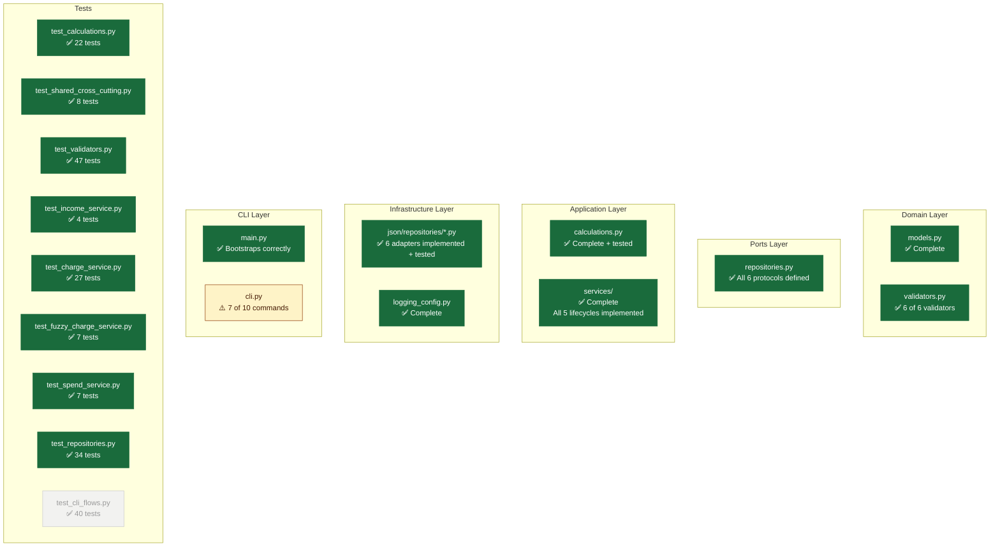

---

## Recommended Next Steps — Phase E

Build in this order. Each step unblocks the next.

```mermaid
flowchart LR
    S1["1. Wire spend add\nwith strict CLI validation"]
    S2["2. Wire charge mark-paid\nUUID parse + service delegation"]
    S3["3. Wire dashboard show\naggregate repos via service"]
    S4["4. Expand CLI flow tests\nfor remaining commands"]
    S5["5. Run full quality gate\npytest + docs freeze"]
    S6["6. Stage 2 handoff\nlock final Stage 1 scope"]

    S1 --> S2 --> S3 --> S4 --> S5 --> S6

    style S1 fill:#dbeafe,stroke:#1d4ed8,color:#1e3a8a
    style S2 fill:#dbeafe,stroke:#1d4ed8,color:#1e3a8a
    style S3 fill:#dbeafe,stroke:#1d4ed8,color:#1e3a8a
    style S4 fill:#fef3c7,stroke:#92400e,color:#451a03
    style S5 fill:#fcebeb,color:#a32d2d,stroke:#a32d2d
    style S6 fill:#ede9fe,stroke:#7c3aed,color:#4c1d95
```

> Phase E now has three commands remaining: `spend add`, `charge mark-paid`, and a fully wired
> `dashboard show` read path. After these are complete, Stage 1 moves directly to the final quality gate.

---

## Runtime Architecture

How the layers connect at runtime — entry point through storage.

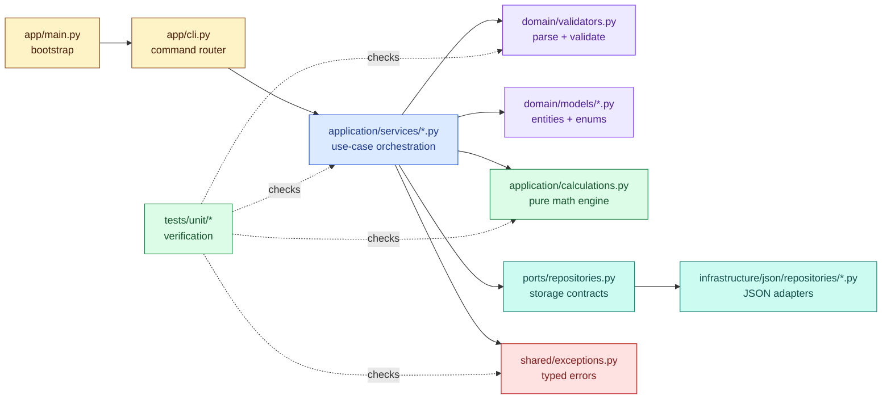

---

## File Catalogue

What each runtime file takes, what it passes on, and what it does.

### Runtime files

| File | Takes from | Passes to | Role |
|---|---|---|---|
| `app/main.py` | CLI args, logger factory, repo/service instances | `CliApplication.run(...)` | Application bootstrap and wiring |
| `app/cli.py` | parsed args, service objects | service methods, terminal output | Command routing layer |
| `application/calculations.py` | `Decimal` inputs, calendar totals | `BalanceSnapshot`, state enums | Pure balance math — no side effects |
| `application/services/session_service.py` | opening balance, session repo, logger | `SessionRepository.create(...)` | Starts new budgeting session |
| `application/services/income_service.py` | amount, tag, date, session, income repo | `IncomeRepository.add(...)` | Logs income into current session |
| `application/services/charge_service.py` | charge inputs, charge/rule repos, session | one-off charges, recurring rules, next occurrences | Creates and updates committed charges |
| `application/services/balance_service.py` | pre-aggregated totals, `BalanceEngine`, logger | `BalanceSnapshot` | Builds dashboard snapshot |
| `application/services/spend_service.py` | amount, description, category, date, session repo | `TransactionRepository.add(...)` | Logs spend transactions into current session |
| `domain/validators.py` | raw strings from CLI | typed `Decimal`, `date`, enums, or `ValidationError` | Converts user input to domain-safe values |
| `domain/models/session.py` | UUID, date, Decimal fields | `AppSession` | Session entity definition |
| `domain/models/income.py` | amount, tag, date | `IncomeEntry`, `IncomeSourceTag` | Income entity definition |
| `domain/models/charges.py` | charge and rule fields | `CommittedCharge`, `RecurringRule`, `FuzzyCharge`, enums | Charge entity definitions |
| `domain/models/balance.py` | monthly and session totals | `MonthlyBudgetView`, `BalanceSnapshot`, enums | Dashboard output model definitions |
| `domain/models/transaction.py` | spend fields | `Transaction`, `TransactionCategory` | Spending entity definition |
| `ports/repositories.py` | domain entities and UUIDs | `Protocol` contracts for storage | Boundary between application and infrastructure |
| `infrastructure/logging_config.py` | level, logger name | configured logger | Application logging setup |
| `infrastructure/json/repositories/session_repository.py` | `AppSession`, JSON storage state | active session read/write | JSON-backed session adapter |
| `shared/exceptions.py` | failure conditions | typed exception hierarchy | Project-wide error boundary |

### Test files

| File | Takes from | Passes to | Role |
|---|---|---|---|
| `tests/conftest.py` | project root, pytest startup | `src/` on import path, terminal formatting | Shared pytest setup + colored output |
| `tests/unit/conftest.py` | `BalanceEngine` class | reusable `engine` fixture | Shared unit fixture |
| `tests/unit/test_calculations.py` | `engine` fixture, numeric inputs | output assertions | Verifies pure balance math |
| `tests/unit/test_validators.py` | raw strings, `ValidationError`, enums | typed values or failure assertions | Verifies parser and validation rules |
| `tests/unit/test_shared_cross_cutting.py` | exception classes, logger factory | type and config assertions | Verifies shared errors and logging |
| `tests/unit/test_income_service.py` | in-memory repos, `IncomeService`, session fixture | persisted entries or exceptions | Verifies income lifecycle |
| `tests/unit/test_charge_service.py` | in-memory repos, `ChargeService`, session fixture, date monkeypatching | charges, rules, next occurrences, exceptions | Verifies charge lifecycle |
| `tests/unit/test_fuzzy_charge_service.py` | in-memory repos, `FuzzyChargeService`, session fixture | fuzzy add/resolve/discard transitions | Verifies fuzzy lifecycle |
| `tests/unit/test_spend_service.py` | in-memory repos, `SpendService`, session fixture | persisted spends and validation errors | Verifies spend lifecycle |

---

## Detailed File Flows

Data flow for the major runtime files.

### `app/main.py`

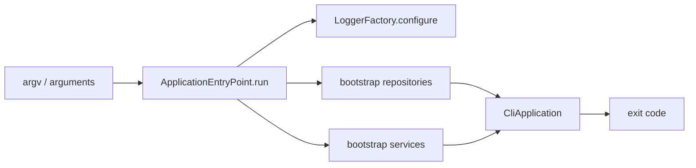

### `app/cli.py`

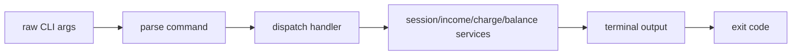

### `application/calculations.py`

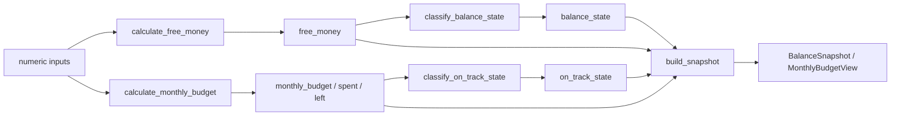

### `application/services/session_service.py`

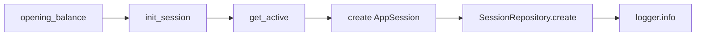

### `application/services/income_service.py`

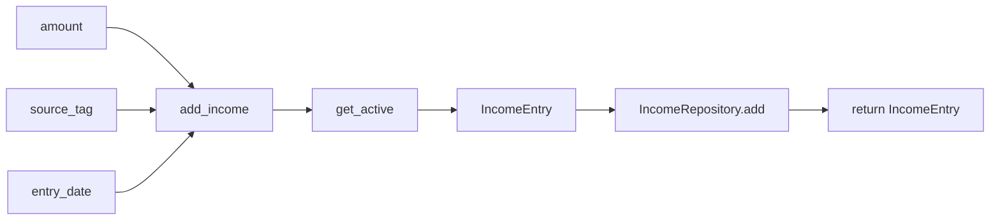

### `application/services/charge_service.py`

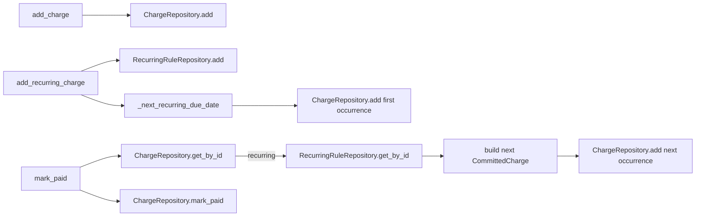

### `application/services/balance_service.py`

```mermaid
flowchart LR
    TOTALS["pre-aggregated totals"] --> BUILD["build_snapshot"]
    BUILD --> ENGINE["BalanceEngine.build_snapshot"]
    ENGINE --> SNAP["BalanceSnapshot"]
    SNAP --> LOG["logger.info"]
    LOG --> OUT["return snapshot"]
```

### `application/services/spend_service.py`

```mermaid
flowchart LR
    AMT["amount"] --> ADD["add_transaction"]
    DESC["description"] --> ADD
    CAT["category"] --> ADD
    DATE["spent_on"] --> ADD
    ADD --> SESSION["get_active"]
    SESSION --> TX["Transaction"]
    TX --> SAVE["TransactionRepository.add"]
    SAVE --> OUT["return Transaction"]
```

### `domain/validators.py`

```mermaid
flowchart LR
    RAW["raw string input"] --> DEC["parse_opening_balance / parse_amount"]
    RAW --> TAG["parse_income_source_tag"]
    RAW --> DATE["parse_due_date"]
    RAW --> DAY["parse_day_of_month"]
    RAW --> CAT["parse_transaction_category"]
    DEC --> OUT1["Decimal"]
    TAG --> OUT2["IncomeSourceTag"]
    DATE --> OUT3["date"]
    DAY --> OUT4["int"]
    CAT --> OUT5["TransactionCategory | None"]
    DEC -. invalid .-> ERR["ValidationError"]
    TAG -. invalid .-> ERR
    DATE -. invalid .-> ERR
    DAY -. invalid .-> ERR
    CAT -. invalid .-> ERR
```

### `shared/exceptions.py`

```mermaid
flowchart LR
    FAIL["validation / application / infrastructure / logging failure"] --> BASE["ExpenseTrackerError"]
    BASE --> V["ValidationError"]
    BASE --> A["ApplicationError"]
    BASE --> I["InfrastructureError"]
    BASE --> L["LoggingConfigurationError"]
```

### `ports/repositories.py`

```mermaid
flowchart LR
    SVC["application services"] --> PORT["repository protocols"]
    PORT --> INF["infrastructure adapters"]
    PORT --> TEST["in-memory test doubles"]
```

---

## Reading Order

For a new developer coming to this codebase cold:

1. `Docs/Stage 1.md` — understand the build plan and phase goals
2. `src/expense_tracker/app/main.py` — see how the app bootstraps
3. `src/expense_tracker/app/cli.py` — see how commands are routed
4. `src/expense_tracker/application/calculations.py` — understand the pure engine
5. `src/expense_tracker/domain/models/` — learn the domain entities and enums
6. `src/expense_tracker/domain/validators.py` — see how input is validated
7. `src/expense_tracker/application/services/` — follow the use-case layer
8. `src/expense_tracker/ports/repositories.py` — understand the storage contracts
9. `src/expense_tracker/infrastructure/json/repositories/` — see the adapter stubs
10. `tests/unit/` — read the tests alongside the files they cover

---

*Stage 1 — locked scope. Status as of April 2026.*
