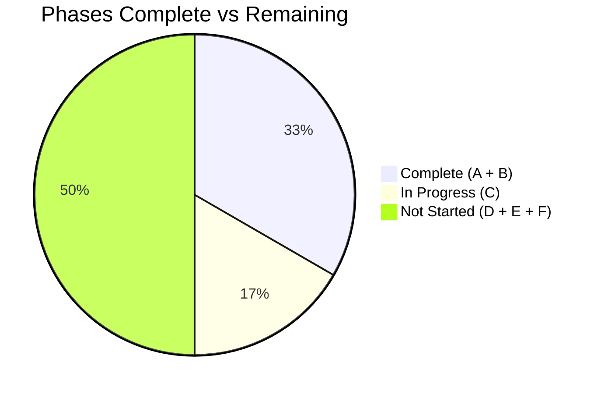
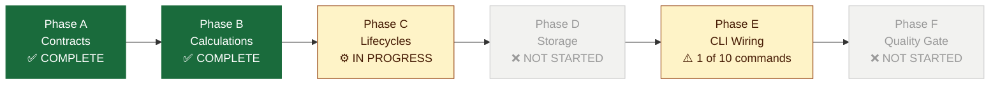
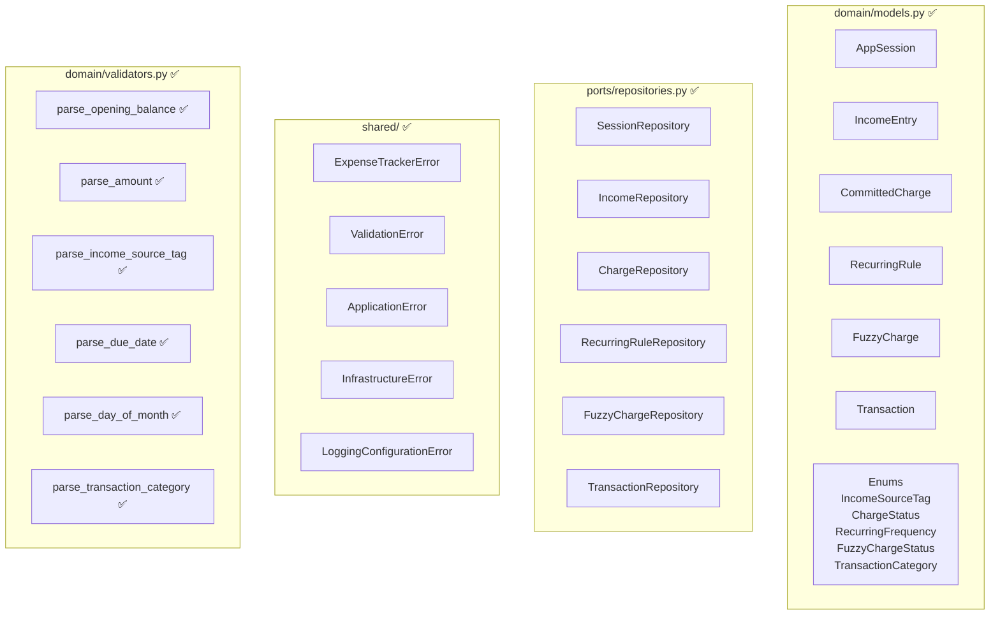
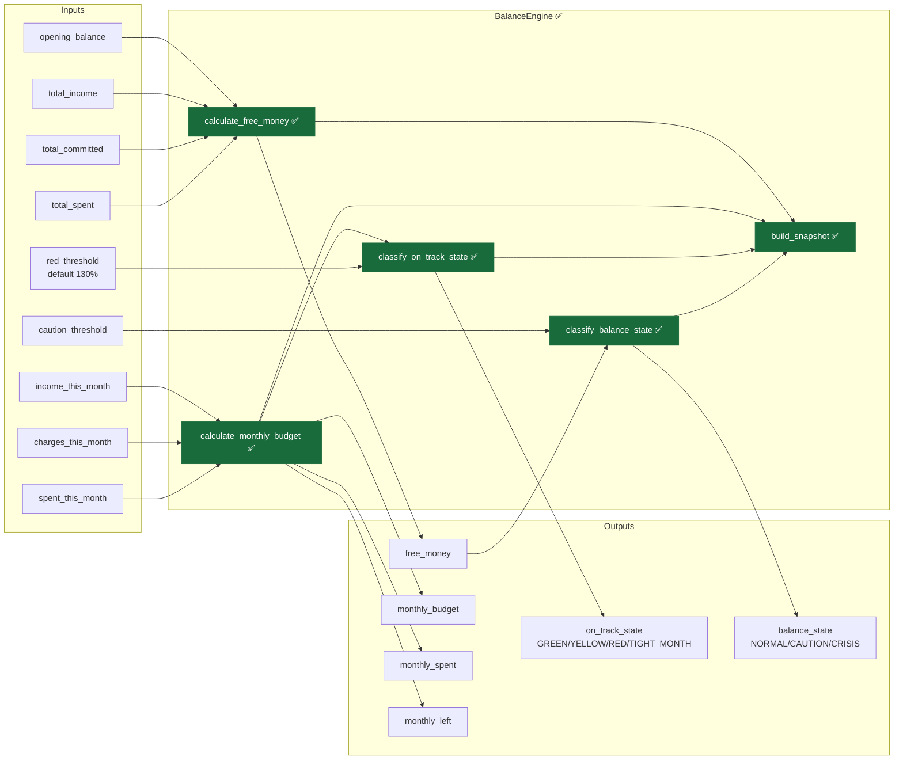
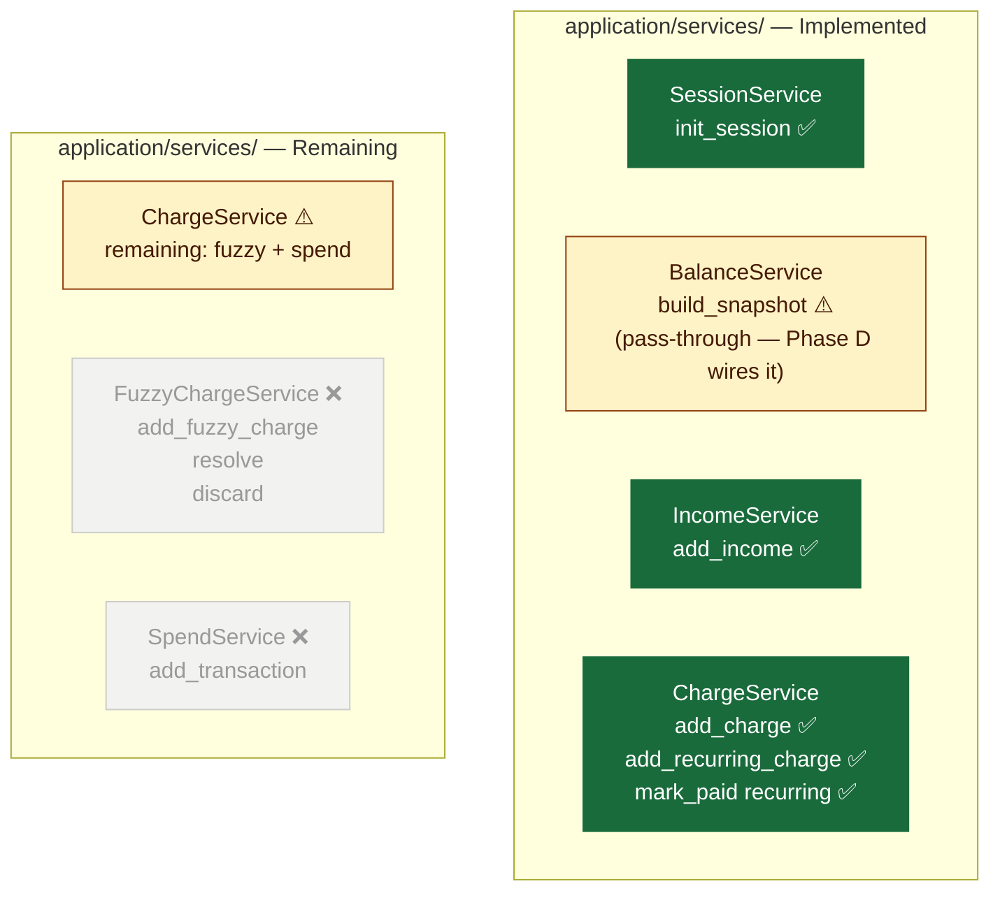
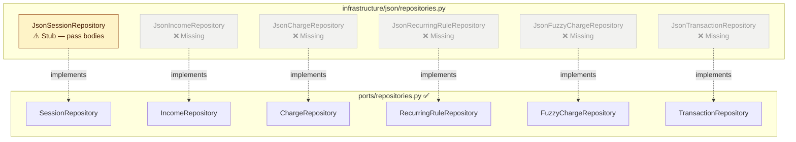
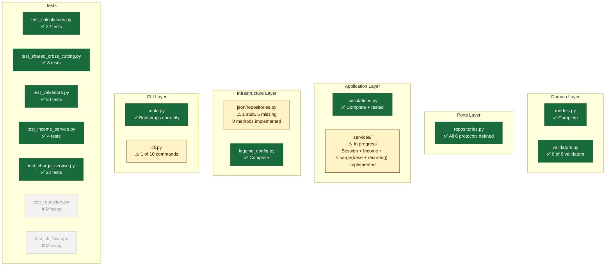
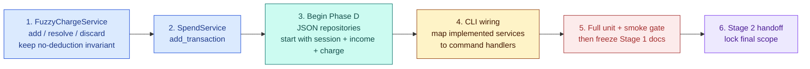

# Stage 1 — Implementation Status
**Student Expense Tracker — CLI Core**
*Audited: 2026-04-15*

> This document is a point-in-time snapshot of what has been built, what is working,
> and what remains before Stage 1 is complete. It maps directly against the Stage 1 Implementation Plan.

---

## Overall Position

**Current phase:** Mid Phase C — core service lifecycles in progress.
**Test suite:** 101 / 101 passing (unit suite).

```mermaid
gantt
    title Stage 1 Build Sequence — Progress
    dateFormat X
    axisFormat %s

    section Phase A — Contracts
    Entities · Protocols · Errors   :done, a1, 0, 1

    section Phase B — Calculations
    BalanceEngine · Unit Tests      :done, b1, 1, 2

    section Phase C — Lifecycles
    Services · Validators · Service Tests :active, c1, 2, 3

    section Phase D — Storage
    JSON Adapters · Repo Tests      :c1, 3, 4

    section Phase E — CLI Wiring
    Command Handlers · Smoke Tests  :c1, 4, 5

    section Phase F — Quality Gate
    Full Suite · Freeze Docs        :c1, 5, 6
```



---

## Phase Progress — At a Glance





---

## Phase A — Contracts `COMPLETE`

All domain entities, value objects, repository protocols, and typed errors are in place.



| Artifact | File | Status |
|---|---|---|
| `AppSession` | `domain/models.py` | ✅ |
| `IncomeEntry` | `domain/models.py` | ✅ |
| `CommittedCharge` | `domain/models.py` | ✅ |
| `RecurringRule` | `domain/models.py` | ✅ |
| `FuzzyCharge` | `domain/models.py` | ✅ |
| `Transaction` | `domain/models.py` | ✅ |
| All enums | `domain/models.py` | ✅ |
| `parse_opening_balance` | `domain/validators.py` | ✅ |
| `parse_amount` | `domain/validators.py` | ✅ |
| `parse_income_source_tag` | `domain/validators.py` | ✅ |
| `parse_due_date` | `domain/validators.py` | ✅ |
| `parse_day_of_month` | `domain/validators.py` | ✅ |
| `parse_transaction_category` | `domain/validators.py` | ✅ |
| `SessionRepository` | `ports/repositories.py` | ✅ |
| `IncomeRepository` | `ports/repositories.py` | ✅ |
| `ChargeRepository` | `ports/repositories.py` | ✅ |
| `RecurringRuleRepository` | `ports/repositories.py` | ✅ |
| `FuzzyChargeRepository` | `ports/repositories.py` | ✅ |
| `TransactionRepository` | `ports/repositories.py` | ✅ |
| Exception hierarchy | `shared/exceptions.py` | ✅ |
| `LoggerFactory` | `infrastructure/logging_config.py` | ✅ |

> **Note on validators:** all Stage 1 validator functions are now implemented and covered by
> `tests/unit/test_validators.py`.

---

## Phase B — Calculations `COMPLETE`

`BalanceEngine` is pure, deterministic, and fully tested at all spec boundaries.



| Artifact | File | Status |
|---|---|---|
| `BalanceEngine.calculate_free_money` | `application/calculations.py` | ✅ |
| `BalanceEngine.calculate_monthly_budget` | `application/calculations.py` | ✅ |
| `BalanceEngine.classify_on_track_state` | `application/calculations.py` | ✅ |
| `BalanceEngine.classify_balance_state` | `application/calculations.py` | ✅ |
| `BalanceEngine.build_snapshot` | `application/calculations.py` | ✅ |
| `MonthlyBudgetView` output type | `application/calculations.py` | ✅ |
| `BalanceSnapshot` output type | `application/calculations.py` | ✅ |
| Unit tests — free money (4 cases) | `tests/unit/test_calculations.py` | ✅ |
| Unit tests — balance state (5 boundary cases) | `tests/unit/test_calculations.py` | ✅ |
| Unit tests — on-track state (7 boundary cases) | `tests/unit/test_calculations.py` | ✅ |
| Unit tests — monthly budget (4 cases) | `tests/unit/test_calculations.py` | ✅ |
| Unit tests — snapshot composition (2 cases) | `tests/unit/test_calculations.py` | ✅ |
| Cross-cutting tests — exceptions + logging | `tests/unit/test_shared_cross_cutting.py` | ✅ |

**Total: calculations remain fully green; full unit suite now passes 84 / 84.**

---

## Phase C — Charge Lifecycles `IN PROGRESS`

Core service wiring has started. Income and committed-charge base lifecycles are implemented; recurring, fuzzy, and spend lifecycles remain.

### Services needed



| Service | Method | Behaviour |
|---|---|---|
| `IncomeService` | `add_income(amount, source_tag, entry_date)` | ✅ Implemented — validates input, creates `IncomeEntry`, persists for active session |
| `ChargeService` | `add_charge(name, amount, due_date)` | ✅ Implemented — creates `CommittedCharge` with `status=UPCOMING` for active session |
| `ChargeService` | `add_recurring_charge(name, amount, day_of_month)` | ✅ Implemented — creates `RecurringRule` and first `CommittedCharge` occurrence |
| `ChargeService` | `mark_paid(charge_id)` | ✅ Implemented — marks paid and creates the next recurring occurrence when linked to a rule |
| `FuzzyChargeService` | `add_fuzzy_charge(session_id, name, due_date, estimated_amount)` | Creates `FuzzyCharge` with `status=PENDING` — **no deduction** |
| `FuzzyChargeService` | `resolve(fuzzy_id, confirmed_amount)` | Sets `status=RESOLVED`, converts to `CommittedCharge`, deducts free money at this moment |
| `FuzzyChargeService` | `discard(fuzzy_id)` | Sets `status=DISCARDED` — no deduction ever |
| `SpendService` | `add_transaction(session_id, amount, description, category, date)` | Validates amount > 0, creates `Transaction`, persists |

### Charge lifecycles remaining

```mermaid
stateDiagram-v2
    direction LR
    note right of upcoming : One-off lifecycle
    [*] --> upcoming : add_charge\ndeducts free_money immediately
    upcoming --> paid : mark_paid
    paid --> [*]
```

```mermaid
stateDiagram-v2
    direction LR
    note right of upcoming : Recurring lifecycle
    [*] --> upcoming : add_recurring_charge\nfirst occurrence created
    upcoming --> paid : mark_paid
    paid --> upcoming : next occurrence\nauto-created immediately
    paid --> [*] : rule deleted
```

```mermaid
stateDiagram-v2
    note right of pending : Fuzzy lifecycle — never touches free_money directly
    [*] --> pending : add_fuzzy_charge\nNO deduction
    pending --> overdue : due date passes
    pending --> resolved : resolve with confirmed amount
    pending --> discarded : discard
    overdue --> resolved : resolve with confirmed amount
    overdue --> discarded : discard
    resolved --> [*] : converts to CommittedCharge\ndeducts free_money HERE
    discarded --> [*] : no deduction ever
```

### Service tests status

Implemented files:
- `tests/unit/test_income_service.py`
- `tests/unit/test_charge_service.py`

Still needed for remaining Phase C behavior:

| Test | What it verifies |
|---|---|
| Recurring `mark_paid` creates next occurrence | Correct `due_date` generated from `day_of_month` |
| Next occurrence deducts free money immediately | Balance decreases at generation time |
| Fuzzy `add_fuzzy_charge` does not affect free money | Core invariant from design file |
| Fuzzy `resolve` converts and deducts at that moment | `CommittedCharge` created, free money drops |
| Fuzzy `discard` makes no deduction | Free money unchanged |
| FuzzyCharge and CommittedCharge stay in separate stores | Never mixed across repos |

---

## Phase D — Storage `NOT STARTED`

The JSON adapter file exists but every method body is `pass` — nothing is implemented.



| Adapter | Status | Notes |
|---|---|---|
| `JsonSessionRepository` | ⚠️ Stub | Class exists, all methods are `pass` |
| `JsonIncomeRepository` | ❌ Missing | Class does not exist |
| `JsonChargeRepository` | ❌ Missing | Class does not exist |
| `JsonRecurringRuleRepository` | ❌ Missing | Class does not exist |
| `JsonFuzzyChargeRepository` | ❌ Missing | Class does not exist |
| `JsonTransactionRepository` | ❌ Missing | Class does not exist |
| Repository tests | ❌ Missing | `tests/unit/test_repository.py` does not exist |

**Serialisation rules** that each adapter must follow (per design contracts):
- `Decimal` → stored as `str` (never `float`)
- `date` → stored as ISO 8601 string (`YYYY-MM-DD`)
- `UUID` → stored as `str`
- `Enum` → stored as `.value`

**Repository test requirements** (per spec):
- CRUD operations for all five entity types
- `list_for_month` returns only entries in the correct calendar month
- Data persists correctly across a simulated restart (write → re-instantiate adapter → read back)

---

## Phase E — CLI Wiring `1 of 10 commands`

```mermaid
graph TD
    CLI[CliApplication]

    CLI --> SI["session init\n✅ WIRED"]
    CLI --> IA["income add\n❌ Missing"]
    CLI --> CA["charge add\n❌ Missing"]
    CLI --> CAR["charge add --recurring\n❌ Missing"]
    CLI --> FCA["fuzzy-charge add\n❌ Missing"]
    CLI --> FCR["fuzzy-charge resolve\n❌ Missing"]
    CLI --> FCD["fuzzy-charge discard\n❌ Missing"]
    CLI --> SA["spend add\n❌ Missing"]
    CLI --> CMP["charge mark-paid\n❌ Missing"]
    CLI --> DS["dashboard show\n⚠️ Scaffold only\nPhase D dependency"]

    style SI fill:#1a6b3c,color:#fff,stroke:#1a6b3c
    style DS fill:#fef3c7,stroke:#92400e,color:#451a03
    style IA fill:#f2f2f0,stroke:#ccc,color:#999
    style CA fill:#f2f2f0,stroke:#ccc,color:#999
    style CAR fill:#f2f2f0,stroke:#ccc,color:#999
    style FCA fill:#f2f2f0,stroke:#ccc,color:#999
    style FCR fill:#f2f2f0,stroke:#ccc,color:#999
    style FCD fill:#f2f2f0,stroke:#ccc,color:#999
    style SA fill:#f2f2f0,stroke:#ccc,color:#999
    style CMP fill:#f2f2f0,stroke:#ccc,color:#999
```



| Command | Arguments | Handler | Status |
|---|---|---|---|
| `session init` | `--balance` | `handle_session_init` | ✅ |
| `income add` | `--amount --source --date` | — | ❌ |
| `charge add` | `--name --amount --due-date` | — | ❌ |
| `charge add --recurring` | `--name --amount --day-of-month` | — | ❌ |
| `fuzzy-charge add` | `--name --due-date [--estimate]` | — | ❌ |
| `fuzzy-charge resolve` | `--id --amount` | — | ❌ |
| `fuzzy-charge discard` | `--id` | — | ❌ |
| `spend add` | `--amount --description [--category] [--date]` | — | ❌ |
| `charge mark-paid` | `--id` | — | ❌ |
| `dashboard show` | *(no arguments)* | `handle_dashboard_show` | ⚠️ Scaffold |

> **`dashboard show` note:** The handler correctly accepts no arguments and rejects any that are
> passed. It returns a Phase D not-yet-implemented error until the repository layer is wired and
> a `DashboardService` aggregates totals from all repositories.

**CLI smoke tests** (`tests/unit/test_cli_flows.py`) — file does not exist yet.

---

## Phase F — Quality Gate `NOT STARTED`

| Item | Status |
|---|---|
| Full test suite green | ✅ 101/101 unit tests pass |
| Service tests for implemented methods | ✅ `test_income_service.py`, `test_charge_service.py` |
| `tests/unit/test_repository.py` exists | ❌ |
| `tests/unit/test_cli_flows.py` exists | ❌ |
| Stage 1 behaviour frozen in docs | ❌ |
| Stage 2 handoff note written | ❌ |

---

## Layer-by-Layer Summary



---

## Recommended Next Steps — Phase C

Build in this order. Each step unblocks the next.



> Phase D (JSON adapters) can begin **in parallel from step 3 onwards** — service tests use
> in-memory fakes and do not depend on real adapters. Writing adapters alongside services
> keeps the two in sync and avoids a large Phase D catch-up sprint.

---

*Stage 1 — locked scope. Status as of April 2026.*
