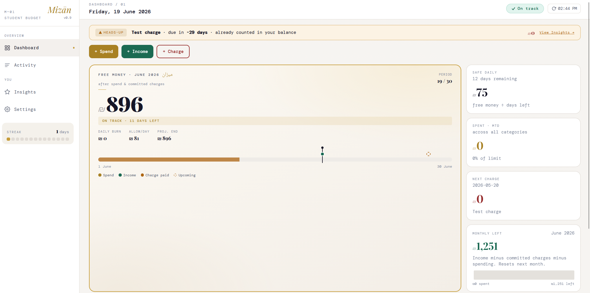

# Mizān — Student Expense Tracker

> Know exactly how much you can spend today — after bills, before regret.

Personal project — built to solve a real budgeting problem.

---

## The problem

Your bank balance is a lie. It shows ₪2,000 available while next week's rent, the phone bill, and a subscription are all still sitting in there uncounted. Nothing deducts future obligations until they actually clear — so students spend freely, then hit month-end in crisis.

I kept running into this as a student, so I built Mizān — ميزان, Arabic for *"balance"* — to try and fix it for myself.

---

## How it works

```
free money = opening balance + income − committed charges − recorded spend
```

The key rule: **committed charges deduct the moment they're logged — not when they're due.** The instant you enter rent, it's gone from your usable balance. What you see is what you can actually spend.

---

## Screenshot



---

## Live docs

[**→ Landing page · Architecture · Project overview**](https://moaminshikha.github.io/student-expense-tracker/)

---

## Stack

| Layer | Technology |
|---|---|
| Frontend | React 18 + TypeScript + Vite + Tailwind CSS |
| Backend | FastAPI (Python 3.10+) |
| Storage | JSON files under `data/` (no database required) |

---

## Architecture

Five-layer clean architecture — domain models have no knowledge of persistence or HTTP.
[→ Architecture diagram](https://moaminshikha.github.io/student-expense-tracker/architecture.html)

---

## Features

| Feature | Description |
|---|---|
| Dashboard | Free Money, Safe Daily, month timeline, upcoming charges |
| Activity | Full transaction history, filter by month, delete entries |
| Insights | Weekly spend trend, category breakdown, nudges |
| Settings | Currency symbol/code, display name |

---

## Quick start

**Requirements:** Python 3.10+, Node.js 18+

```bash
git clone https://github.com/MoaminShikha/student-expense-tracker.git
cd student-expense-tracker

# Backend
pip install -e .
start-backend.bat        # Windows
# or: PYTHONPATH=src python -m uvicorn expense_tracker.app.api:app --host 127.0.0.1 --port 8000

# Frontend (separate terminal)
cd frontend && npm install && npm run dev
```

Open **http://localhost:5173** — enter an opening balance to get started.

---

## Tests

243 unit tests against real JSON files — no mocks.

```bash
pip install -e ".[dev]"
pytest
```

---

## Configuration

| Variable | Default | Description |
|---|---|---|
| `MIZAN_CORS_ORIGINS` | `http://localhost:5173,...` | Comma-separated allowed origins |

---

## License

[PolyForm Noncommercial 1.0.0](LICENSE) — free to use and modify for noncommercial purposes.
