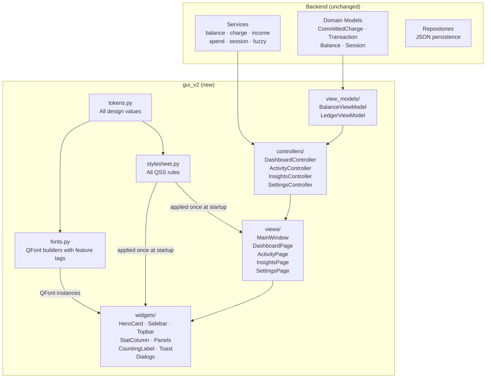
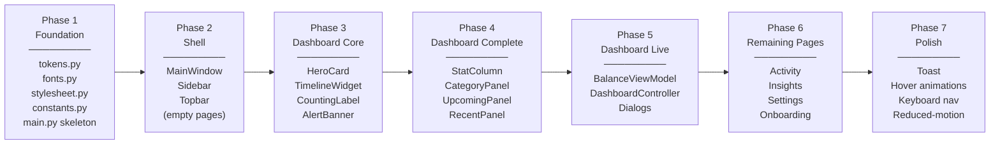
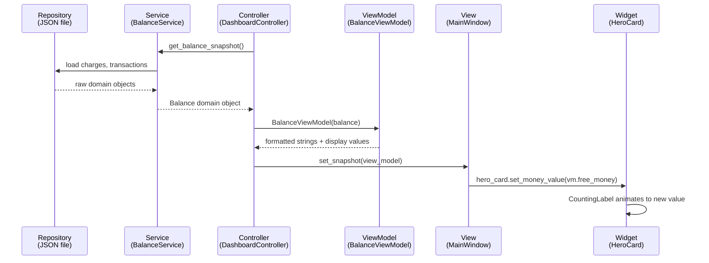
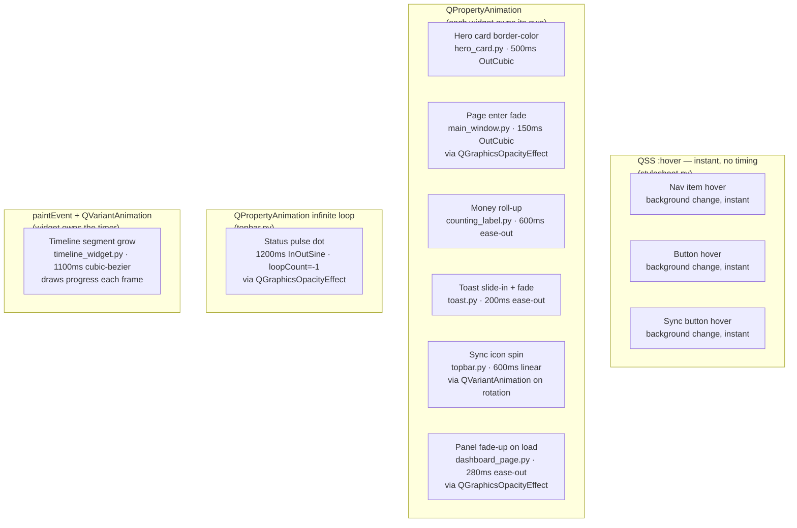

# Mizān GUI v2 — Implementation Spec
> Version 1.1 · 2026-06-10 (revised after spec review)
> Companion to `DESIGN.md`. DESIGN.md answers *what* it looks like. This answers *how* to build it.

---

## 1. Strategy: Dashboard-First

We build the most complex page first. Every hard problem lives on the Dashboard — custom-painted timeline, gradient hero card, animated numbers, 3-column panel layout. Once the Dashboard is clean and stable, every other page is easier and follows the same patterns.

The new GUI lives in `gui_v2/` alongside the existing `gui/`. A single flag in `gui/main.py` controls which runs. The old GUI is never broken.

---

## 2. Layer Architecture



**The rule this diagram enforces:**
- Arrows flow **downward only** — widgets never call services
- `stylesheet.py` touches everything visual, but nothing visual touches `stylesheet.py` after startup
- Controllers are the only objects that know about both services and views
- `fonts.py` is the only place that creates `QFont` instances — widgets call `fonts.money()`, `fonts.label()` etc.

---

## 3. Directory Structure

```
src/expense_tracker/app/
├── gui/
│   ├── main.py                    ← USE_GUI_V2 flag lives here (registered mizaan entry point)
│   └── ...                        ← old GUI, otherwise untouched
│
└── gui_v2/                        ← new GUI
    ├── __init__.py
    ├── main.py                    ← entry point, called by gui/main.py when flag is True
    ├── constants.py               ← PageIndex enum
    ├── tokens.py                  ← ALL design values (colors, sizes, font names)
    ├── fonts.py                   ← QFont builders (money, label, mono, arabic)
    ├── stylesheet.py              ← ALL QSS rules, reads tokens, applied once at startup
    │
    ├── resources/
    │   └── fonts/                 ← font files (symlink or copy from gui/resources/fonts/)
    │
    ├── view_models/
    │   ├── __init__.py
    │   ├── balance_view_model.py  ← formatted strings for dashboard display
    │   └── ledger_view_model.py   ← row data for activity page
    │
    ├── views/
    │   ├── __init__.py
    │   ├── main_window.py         ← shell: sidebar + topbar + QStackedWidget
    │   ├── dashboard_page.py      ← hero row + stat column + panels row + footer
    │   ├── activity_page.py       ← ledger list + action buttons
    │   ├── insights_page.py       ← charts + pattern insight
    │   └── settings_page.py       ← session info + thresholds
    │
    ├── widgets/
    │   ├── __init__.py
    │   ├── sidebar.py             ← brand + nav + streak + user avatar
    │   ├── topbar.py              ← breadcrumb + sparkline + pill + sync + bell
    │   ├── hero_card.py           ← gradient card + money display + state badge
    │   ├── timeline_widget.py     ← custom-painted progress bar
    │   ├── stat_column.py         ← 4 stat cards stacked
    │   ├── panels.py              ← CategoryPanel, UpcomingPanel, RecentPanel
    │   ├── counting_label.py      ← animated number roll-up label
    │   ├── alert_banner.py        ← amber fuzzy charge warning strip
    │   └── toast.py               ← slide-in feedback notification
    │
    └── dialogs/
        ├── __init__.py
        ├── onboarding_dialog.py
        ├── add_income_dialog.py
        ├── add_spend_dialog.py
        └── add_charge_dialog.py
```

---

## 4. Flag-Based Switching

The flag lives in `gui/main.py` — the file registered as the `mizaan` entry point in `pyproject.toml`. No `pyproject.toml` changes needed.

```python
# src/expense_tracker/app/gui/main.py  (top of file, before existing code)

USE_GUI_V2 = True  # ← flip to False to run the old GUI

def main() -> int:
    if USE_GUI_V2:
        from expense_tracker.app.gui_v2.main import main as _main
        return _main()
    # ... existing gui/main.py code continues below unchanged
```

Both GUIs share the same backend — `composition.py` is called identically by both.

---

## 5. Build Order

Build in this exact sequence. Each phase produces something runnable.



**Why this order:**
- Phase 1 establishes the discipline — zero inline styles from the first file
- Phase 2 gives you a runnable window with working navigation immediately
- Phases 3–4 build Dashboard widgets with hardcoded dummy values (no services yet)
- Phase 5 connects real data — this is when the Dashboard comes alive
- Phase 6 follows the same patterns from phases 1–5
- Phase 7 is additive — nothing breaks if deferred

---

## 6. Data Flow

How a number gets from the database to the screen:



**Key principle:** The controller is the only object that knows about services. Views and widgets know nothing about where data comes from — they only receive formatted strings and display values via their `set_*` methods.

---

## 7. The Structural Rule — Detailed

This is the single most important architectural decision. It is what prevents the cascade of breakage.

### What currently breaks the old GUI

```python
# BAD — scattered across 15 different widget files
class HeroCard(QWidget):
    def __init__(self):
        self.setStyleSheet(f"background: {tokens.BG}; border: 1px solid {tokens.HAIRLINE};")
        # ↑ overrides the global stylesheet for this widget subtree
        # ↑ when you change tokens.HAIRLINE, half the app updates, this one doesn't
        # ↑ when an AI patches this, it adds another setStyleSheet that overrides this one
```

### What the rule requires

```python
# GOOD — tokens.py
HAIRLINE = "#e2dccd"
CARD_RADIUS = 14

# GOOD — stylesheet.py (one place, applied once)
def build_stylesheet(t) -> str:
    return f"""
        QFrame#card {{
            border: 1px solid {t.HAIRLINE};
            border-radius: {t.CARD_RADIUS}px;
            background: {t.SURFACE};
        }}
    """

# GOOD — widget (zero style knowledge)
class HeroCard(QFrame):
    def __init__(self):
        super().__init__()
        self.setObjectName("heroCard")   # ← only this, nothing more
```

### How dynamic state changes work (without setStyleSheet)

```python
# State change — use setProperty + QSS dynamic selector
class HeroCard(QFrame):
    def set_state(self, state: str) -> None:
        self.setProperty("balanceState", state)
        self.style().unpolish(self)   # forces QSS re-evaluation
        self.style().polish(self)

# stylesheet.py — handles all states in one place
"""
QFrame#heroCard[balanceState="normal"]  { border: 2px solid #c79a39; }
QFrame#heroCard[balanceState="caution"] { border: 2px solid #f59e0b; }
QFrame#heroCard[balanceState="crisis"]  { border: 2px solid #962e2e; }
"""
```

> **Note:** `setProperty()` + `unpolish/polish` is instant — there is no CSS transition. For a smooth border-color animation, use `QPropertyAnimation` on a custom `_border_color` property with a `paintEvent` override. See Section 12.

---

## 8. PyQt6 Constraints — What CSS Can't Do

These are the most common traps. Know them before writing a single line.

### 8.1 QSS `transition:` does not exist

PyQt6's QSS parser **silently ignores** `transition: color 200ms ease`. Qt has no built-in CSS transition support.

```python
# WRONG — will silently do nothing
"""
QPushButton#actionBtn {
    transition: background 150ms ease;   ← ignored
}
"""

# RIGHT — instant state change via QSS :hover (no timing)
"""
QPushButton#actionBtn          { background: #16172a; }
QPushButton#actionBtn:hover    { background: #181a2c; }
"""

# RIGHT — timed animation via QPropertyAnimation (in the widget)
class ActionButton(QPushButton):
    def enterEvent(self, e):
        self._anim.setEndValue(QColor("#181a2c"))
        self._anim.start()
```

**Decision rule:** For hover color changes where instant is acceptable → use QSS `:hover`. For timed smooth transitions → `QPropertyAnimation` in the widget.

### 8.2 QSS `@keyframes` and `animation:` do not exist

PyQt6's QSS parser **silently ignores** `@keyframes` and `animation:`. The status pulse dot cannot be done with CSS.

```python
# WRONG — will silently do nothing
"""
@keyframes pulse { ... }   ← ignored
.tb-pulse { animation: pulse 2.4s; }   ← ignored
"""

# RIGHT — QTimer drives a QPropertyAnimation on opacity
class PulseDot(QWidget):
    def __init__(self):
        self._opacity = QGraphicsOpacityEffect(self)
        self.setGraphicsEffect(self._opacity)
        self._anim = QPropertyAnimation(self._opacity, b"opacity")
        self._anim.setDuration(1200)
        self._anim.setStartValue(1.0)
        self._anim.setEndValue(0.2)
        self._anim.setEasingCurve(QEasingCurve.Type.InOutSine)
        self._anim.setLoopCount(-1)   # infinite
        self._anim.start()
```

### 8.3 `font-feature-settings` is not a QSS property

QSS ignores `font-feature-settings: 'lnum' 1, 'tnum' 1`. Use `QFont.setFeature()` instead. This is why `fonts.py` exists:

```python
# fonts.py
from PyQt6.QtGui import QFont

def money(size: int = 52, weight: int = 900) -> QFont:
    """Playfair Display with lnum + tnum features enabled."""
    f = QFont("Playfair Display", size)
    f.setWeight(weight)
    f.setFeature(QFont.Tag.fromString("lnum"), 1)
    f.setFeature(QFont.Tag.fromString("tnum"), 1)
    return f

def label(size: int = 11) -> QFont:
    """DM Mono for labels and metadata."""
    return QFont("DM Mono", size)

def arabic(size: int = 25) -> QFont:
    """Noto Naskh Arabic for the brand wordmark."""
    f = QFont("Noto Naskh Arabic", size)
    f.setLayoutDirection(Qt.LayoutDirection.RightToLeft)
    return f
```

Widgets call `self._value_label.setFont(fonts.money(52))` — never construct `QFont` inline in a widget.

### 8.4 `box-shadow` does not exist in QSS

QSS ignores `box-shadow`. Translations:

| CSS | Qt equivalent |
|---|---|
| `inset 0 0 0 1px #e2dccd` | `border: 1px solid #e2dccd` |
| `0 8px 32px rgba(...)` drop-shadow | `QGraphicsDropShadowEffect` on the widget |
| Multiple inset layers | Not possible — use the border only |

Dialogs get their drop-shadow via:
```python
shadow = QGraphicsDropShadowEffect()
shadow.setBlurRadius(32)
shadow.setOffset(0, 8)
shadow.setColor(QColor(24, 26, 44, 30))
dialog.setGraphicsEffect(shadow)
```

### 8.5 `cursor: pointer` is not a QSS property

QSS ignores `cursor: pointer`. Set it in the widget's `__init__`:

```python
self.setCursor(Qt.CursorShape.PointingHandCursor)
```

Since all clickable widgets have `setObjectName()`, add this to every widget that is interactive. It is the one exception to "no code in widget init for style" — there is no other Qt mechanism.

### 8.6 `windowOpacity` only works on top-level windows

For page fade-in inside `QStackedWidget`, `QPropertyAnimation(widget, b"windowOpacity")` silently does nothing on child widgets. Use `QGraphicsOpacityEffect` instead:

```python
# main_window.py — page enter fade
def _fade_in(self, widget: QWidget) -> None:
    effect = QGraphicsOpacityEffect(widget)
    widget.setGraphicsEffect(effect)
    anim = QPropertyAnimation(effect, b"opacity", widget)
    anim.setDuration(150)
    anim.setStartValue(0.0)
    anim.setEndValue(1.0)
    anim.setEasingCurve(QEasingCurve.Type.OutCubic)
    anim.finished.connect(lambda: widget.setGraphicsEffect(None))
    anim.start()
```

### 8.7 Z-index has no meaning in QSS

CSS `z-index` values are meaningless in Qt. Stacking is controlled by:

| Intent | Qt mechanism |
|---|---|
| Topbar above content | Layout order (topbar added first) |
| Dialog above main window | `QDialog` is a separate window — always on top of parent |
| Toast above everything | `Qt.WindowType.Tool` flag on a top-level QWidget |
| Dropdown above panel | `raise_()` call after show |

Remove Z-index values from `tokens.py` — they have no implementation use.

### 8.8 Hero card gradient must use `paintEvent`

Qt's QSS gradient syntax (`qradialgradient`, `qlineargradient`) cannot reproduce the multi-layer CSS3 radial gradient in DESIGN.md Section 3.3. Use a custom `paintEvent` as the existing `hero_card.py` already does. The stylesheet only handles the **border color** (via `setProperty` + QSS selector). Everything else — gradients, dot-grain texture, rounded corners — is painted in `paintEvent`.

---

## 9. Widget Responsibilities (one sentence each)

| Widget | Does exactly one thing |
|---|---|
| `tokens.py` | Holds design values — no logic, no imports |
| `fonts.py` | Builds `QFont` instances with correct features — no widgets |
| `stylesheet.py` | Assembles QSS from tokens — no widgets, no logic |
| `Sidebar` | Renders nav, emits `nav_changed` signal — no routing logic |
| `Topbar` | Renders breadcrumb + controls, emits `refresh_requested` — no data |
| `HeroCard` | Paints gradient card + displays free money + state — accepts strings, emits nothing |
| `TimelineWidget` | Custom-paints timeline segments — accepts percentages only |
| `CountingLabel` | Animates a displayed number from old to new value — no business logic |
| `StatColumn` | Renders 4 stat cards — accepts a BalanceViewModel |
| `CategoryPanel` | Renders spend-by-category rows + "Add Income" button |
| `UpcomingPanel` | Renders charge rows + "Add Charge" button, emits `charge_paid` |
| `RecentPanel` | Renders recent transaction rows + "Add Spend" button |
| `AlertBanner` | Shows/hides amber fuzzy charge warning — accepts text strings |
| `Toast` | Shows timed feedback message — self-dismisses after 3s |
| `DashboardController` | Reads services → builds ViewModels → calls view setters |
| `BalanceViewModel` | Converts Balance domain object → formatted display strings |
| `SettingsController` | Reads/writes caution threshold via QSettings — no view logic |

---

## 10. What gui_v2 Reuses (copy, then strip)

Copy these files from the old GUI into `gui_v2/`. Then remove all `.setStyleSheet()` calls and add `setObjectName()` where missing.

| Source file | Destination | Strip / change |
|---|---|---|
| `gui/widgets/counting_label.py` | `gui_v2/widgets/counting_label.py` | Correct animation logic — no QSS to strip |
| `gui/widgets/timeline_widget.py` | `gui_v2/widgets/timeline_widget.py` | Correct paint logic — strip any inline QSS |
| `gui/widgets/toast.py` | `gui_v2/widgets/toast.py` | Strip inline QSS, replace emoji icons with SVG |
| `gui/widgets/heads_up_alert.py` | `gui_v2/widgets/alert_banner.py` | Rename + strip inline QSS |
| `gui/view_models/balance_view_model.py` | `gui_v2/view_models/balance_view_model.py` | No changes needed |
| `gui/view_models/ledger_view_model.py` | `gui_v2/view_models/ledger_view_model.py` | No changes needed |
| `gui/constants.py` | `gui_v2/constants.py` | No changes needed |
| `gui/dialogs/onboarding_dialog.py` | `gui_v2/dialogs/onboarding_dialog.py` | Strip inline QSS |
| `gui/styles/fonts.py` | `gui_v2/fonts.py` | Rewrite to use `QFont.setFeature()` — see Section 8.3 |
| `gui/resources/fonts/` | `gui_v2/resources/fonts/` | Symlink or copy the font files directory |

---

## 11. What gui_v2 Improves Over gui

| Problem in gui | Fix in gui_v2 |
|---|---|
| Inline `setStyleSheet()` in every widget | Zero inline styles — `stylesheet.py` only |
| `theme_manager.py` + dual-palette complexity | Deleted — one theme, one stylesheet |
| State changes via string interpolation | `setProperty()` + QSS dynamic selectors |
| HeroCard gradient in QSS (unreliable) | Gradient fully in `paintEvent` — QSS handles border only |
| `cursor: pointer` missing everywhere | `setCursor(PointingHandCursor)` in every interactive widget init |
| `box-shadow` in design tokens | Replaced with `border` (inset) and `QGraphicsDropShadowEffect` (dialogs) |
| Missing: streak box, user avatar, status pulse pill | Added per `DESIGN.md` Section 3 |
| Missing: bell notification button | Added per `DESIGN.md` Section 3.2 |
| Missing: `fonts.py` with feature tags | `fonts.py` centralises all `QFont` construction with lnum/tnum |

---

## 12. Animation Implementation Map

Every animation has exactly one owner. This is the definitive map.



### Decision table — which mechanism to use

| Situation | Use | Notes |
|---|---|---|
| Hover background/border change, instant OK | QSS `:hover` in `stylesheet.py` | Zero Python, single source |
| Hover with smooth timing | `QPropertyAnimation` in widget `enterEvent`/`leaveEvent` | enterEvent triggers animation |
| Number interpolation | `QPropertyAnimation` on custom property | See `counting_label.py` |
| Widget fade-in | `QPropertyAnimation(QGraphicsOpacityEffect, b"opacity")` | Remove effect after finish |
| Infinite pulse / loop | `QPropertyAnimation` with `setLoopCount(-1)` | Not `@keyframes` — that's CSS only |
| Custom drawn shape progressing | `QVariantAnimation` → callback → `update()` | Drives `paintEvent` repaint |

### Reduced-motion

PyQt6 6.7 does not expose `QStyleHints.reducedMotion()`. Use a `QSettings` key the user can toggle in Settings page:

```python
# anywhere in the app
from PyQt6.QtCore import QSettings

def motion_reduced() -> bool:
    return QSettings("Mizan", "Mizan").value("accessibility/reducedMotion", False, type=bool)

# in every widget that owns a QPropertyAnimation:
if motion_reduced():
    self._anim.setDuration(0)
```

The Settings page exposes a "Reduce motion" toggle that writes this key. `stylesheet.py` reads `motion_reduced()` at startup and omits QSS `:hover` background transitions if True (they are instant anyway, so this mainly affects any future QSS we might add).

---

## 13. Settings Persistence

The Settings page needs to read and write two values:

| Setting | Storage | Key |
|---|---|---|
| Caution threshold | `QSettings("Mizan", "Mizan")` | `"balance/cautionThreshold"` |
| Reduce motion | `QSettings("Mizan", "Mizan")` | `"accessibility/reducedMotion"` |

`SettingsController` reads these on page enter and writes them on save. The threshold is passed to `DashboardController` at construction — if the setting changes, the user needs to restart for it to take effect (acceptable for now; note this in the Settings page UI).

---

## 14. Keyboard Shortcuts

| Shortcut | Action |
|---|---|
| `Alt+1` | Navigate to Dashboard |
| `Alt+2` | Navigate to Activity |
| `Alt+3` | Navigate to Insights |
| `Alt+4` | Navigate to Settings |
| `Ctrl+R` | Refresh current page |
| `Escape` | Close open dialog |

Implemented in `MainWindow.keyPressEvent`. Dialogs handle `Escape` via `QDialog`'s default behaviour.

---

## 15. Minimum Window Size

`MainWindow.setMinimumSize(1100, 720)`.

Rationale: 210px sidebar + 290px stat column + 24px × 2 content padding + 3 equal panels × ~170px minimum = ~1050px. 1100px provides a small buffer.

---

## 16. Insights Page — Charts

The Insights page requires bar charts. PyQt6 has no built-in chart widget. Use `QPainter` in a custom `paintEvent` — consistent with `TimelineWidget` and avoids an external dependency.

Two chart widgets needed:
- `CategoryBarChart` — horizontal bars, one per category, colored by category token
- `MonthlyTrendChart` — vertical bars, one per month, `GOLD_LEAF` color

Both accept a list of `(label: str, value: float, color: str)` tuples. No interaction required in Phase 6 — display only.

---

## 17. Testing Approach

**No widget unit tests.** Visual widgets are hard to test in isolation and the effort rarely pays off. Instead:

| What to test | How |
|---|---|
| ViewModels | Unit test — pure Python, no Qt needed |
| `fonts.py` helpers | Unit test — verify QFont properties |
| Controllers (logic only) | Unit test with mock services |
| Visual correctness | Run the app, compare against `DESIGN.md` Section 12 checklist |
| Regression | Old GUI still runs with `USE_GUI_V2 = False` |

Existing tests in `tests/unit/` are unaffected — they test services and domain logic, not the GUI.

---

## 18. Phase Completion Criteria

A phase is done when **all** conditions are met:

| Phase | Done when |
|---|---|
| 1 — Foundation | `tokens.py` matches `DESIGN.md` Section 2. `fonts.py` returns `QFont` with correct features. `stylesheet.py` applies without errors. Window opens (even if blank). |
| 2 — Shell | Sidebar nav switches between 4 placeholder pages. Topbar shows correct breadcrumb per page. `USE_GUI_V2 = True` launches the new window; `False` launches the old one. |
| 3 — Dashboard Core | HeroCard renders with Playfair Display money figure, correct gradient (via `paintEvent`), and correct border color for each of the three states. CountingLabel animates. |
| 4 — Dashboard Complete | All 3 panels render with dummy data. Stat column renders. Alert banner shows/hides. Layout matches `DESIGN.md` Section 4.1 at 1280 × 720. |
| 5 — Dashboard Live | Real data from services populates dashboard. Adding income/spend/charge updates displayed values. |
| 6 — Remaining Pages | Activity ledger scrolls and shows real transactions. Insights bar charts render. Settings page reads/writes caution threshold. Onboarding dialog fires on first run. |
| 7 — Polish | Toast appears on every add action. All keyboard shortcuts work. Pulse dot animates on status pill. Reduce-motion toggle collapses all animations to instant. |

---

*Read alongside `DESIGN.md`. This spec answers how to build; DESIGN.md answers what to build.*
